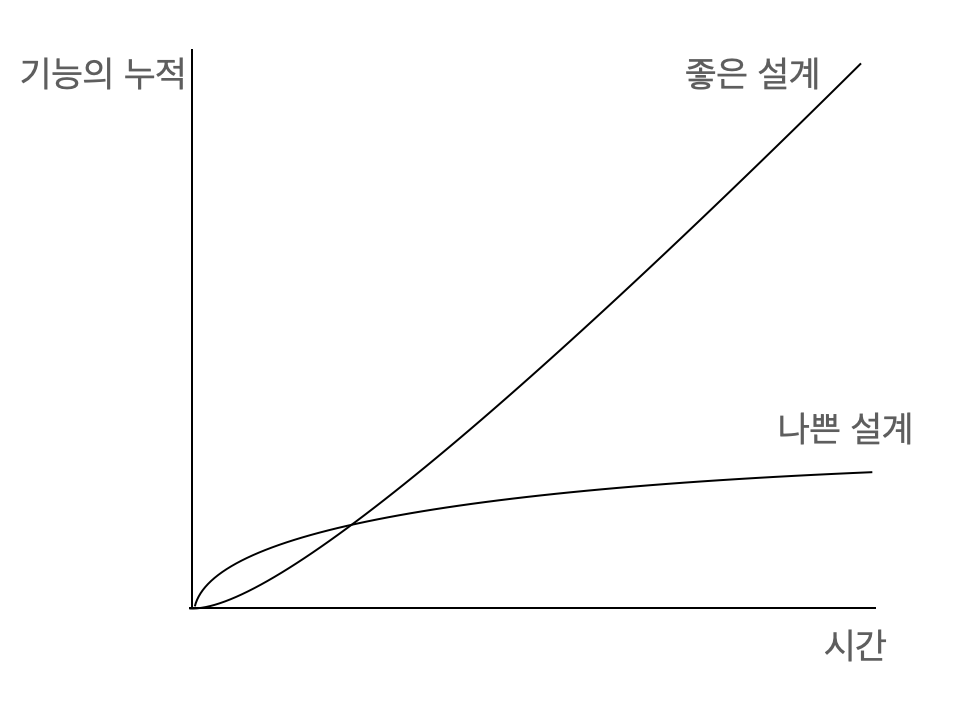

# 리팩터링 원칙

2장의 내용은 정말 한 문장 하나하나가 많은 생각을 하게끔 해주고 인사이트를 주었다. 그렇다고 책 내용을 그대로 옮겨올 수도 없는 노릇이기에 이 글을 읽는 분들이 이 책에 흥미를 가지길 바라며 책의 내용과 내 생각을 간단히 정리하여 글로 남긴다.

### 2.1 리팩터링 정의

- 소프트웨어의 겉보기 동작(Observable behavior)은 그대로 유지한 채, 코드를 이해하고 수정하기 쉽도록 내부 구조를 변경하는 기법
- 소프트웨어의 겉보기 동작은 그대로 유지한 채, 여러 가지 리팩터링 기법을 적용해서 소프트웨어를 재구성하다.

책에서 저자는 단순히 코드를 정리하는 작업이 리팩터링이 아니라 특정한 방식에 따라 작은 단계들을 거쳐 큰 변화를 만들어내는 코드의 수정이 리팩터링이라고 말한다. 이 단계들은 순차적으로 연결되며 각 단계는 매우 작을 수도 클 수도 있지만 각 단계들은 항상 코드가 잘 작동하는 상태기 때문에 전체 작업이 끝나지 않았더라도 얼마든지 멈출 수 있다고 한다. 아마 우리가 지금까지 리팩터링이라고 말하면서 해왔던 것은 저자가 말하는 리팩터링이 맞을 수도, 아닐 수도 있다. 어떤 원칙 아래 이런 리팩터링을 진행했었다면 좋겠지만 적어도 나는 단일 책임 원칙 정도를 신경쓰긴 했지만 이 외에 어떠한 방식이나 원칙을 생각하지는 않았던 것 같다. 특히 나에게 있어서 리팩터링은 시작하면 멈출 수 없는 하나의 큰 작업 단위였는데 저자에게 이런 부분을 정확히 지적당한 기분이다.
실제로 책에 `누군가 "리팩터링 하다가 코드가 깨져서 며칠이나 고생했다"라고 한다면 십중팔구 리팩터링 한 것이 아니다` 라는 말이 적혀있다.
그렇다. 나는 리팩터링이 아니라 코드를 가지고 블록놀이를 한 것이였다...

### 2.2 두 개의 모자

기능 추가와 리팩터링은 하나의 모자와 같다. 모자는 결코 한 번에 두개를 쓰지 않는다. 모자를 바꿔 쓸 일이 없게 한 번에 리팩터링 모자가 필요없는 완벽한 기능추가를 할 수 있다면 좋겠지만 이는 불가능하다. 나는 기능을 추가하다가 기존 코드를 자주 건드리는 편이였는데 이러다보니 항상 커밋하기가 불편했었다. 하나의 작업 단위를 커밋에 담고 싶은데 이외의 코드 수정들이 포함되서 IDE툴로 커밋을 따로 분리해서 하는 공수를 들이기도 했었다. 앞으로도 "당장 하는 김에 한꺼번에 할까" 라는 마음이 들 거 같기는 하다. 내가 지금 하는 작업이 무엇인지에 대해 명확히 인지하고 모자를 한꺼번에 두 개 쓰는 일을 줄여봐야겠다.

### 2.3 리팩터링하는 이유

저자는 리팩터링이 소프트웨어의 모든 문제점을 해결해주는 만병통치약은 아니지만 코드를 건강한 상태로 유지하는 데 도와주는 약이라고 한다. 저자는 이 약이 가지는 4가지 효능을 우리에게 소개해준다.

1. 리팩터링하면 소프트웨어 설계가 좋아진다.

   규칙적인 리팩터링은 코드의 구조를 지탱해주고 시스템이 예상대로 작동하는 것을 보장해준다.

2. 리팩터링하면 소프트웨어를 이해하기 쉬워진다.

   프로그램을 동작시키는 데만 신경쓰면 나중에 그 코드를 다룰 개발자들을 배려하지 못하게 되는 경우가 많다. 문제는 미래에 그 코드를 보게 될 다른 사람이 나 자신일 때도 많다는 것이다. 우리 자신을 위해서라도 리팩터링으로 코드의 목적을 잘 드러낼 수 있게끔 리팩터링 해보자.

3. 리팩터링하면 버그를 쉽게 찾을 수 있다.

   리팩터링 하는 과정에서 코드에 대해 깊이 이해하게 되며 애매하던 부분들이 명확해진다. 그 과정에서 버그는 자연스럽게 드러난다.
   켄트 백은 자신은 뛰어난 프로그래머가 아니라 뛰어난 습관을 지닌 괜찮은 프로그래머라는 말을 했다고 한다.

4. 리팩터링하면 프로그래밍 속도를 높일 수 있다.


처음엔 일정이 촉박해서, 귀찮아서 등의 다양한 이유로 우린 설계를 부패시켜나간다. 하지만 이러면 당장은 조금 빠르더라도 이후의 기능 추가나 수정에서 기술부채폭탄을 떠앉아야할 것이다.
지금 만들고 다신 들여다보지 않을 소프트웨어가 아니라면(설령 그렇다 하더라도!) 좀 더 멀리까지 내다보고 미래의 우리를 위해 좋은 설계를 지켜나가도록 하자.

### 2.4 언제 리팩터링해야 할까?

- **준비를 위한 리팩터링: 기능을 쉽게 추가하게 만들기**

```
지금 동쪽으로 100km를 이동하려는데 그 사이를 숲이 가로막고 있다면, 좀 둘러가더라도 20km 북쪽에 있는 고속도로를 타는 편이 훨씬 빠를 수 있다. 다들 '직진!'을 외치더라도 때로는 '지도를 보고 가장 빠른 경로를 찾아보자'고 말할 줄 알아야한다. 준비를 위한 리팩터링이 바로 이런 역할을 한다.
- 제시카 커
```

기능 추가 하기 직전의 시점이 리팩터링하기 가장 좋은 시점이라고 한다. 기능을 추가하기 전에 현재 코드를 한 번 둘러보고 제시카 커 가 말한 고속도로가 존재할지 찾아보는 시간을 가져보자.

- **이해를 위한 리팩터링: 코드를 이해하기 쉽게 만들기**

  코드를 수정하려면 먼저 그 코드가 하는 일을 파악해야 한다.
  코드를 파악할 때마다 그 코드의 의도가 더 명확하게 드러나도록 리팩터링할 여지는 없을지 찾아보자. 그 과정에서 코드와 설계를 더 깊은 수준까지 이해하게 될 것이다.

- **쓰레기 줍기 리팩터링**

  현재 하던 일에 관련이 없는 곳에서 리팩터링할 부분을 발견할 수도 있을 것이다. 이럴 때는 조금이나마 개선해두자. 쓰레기 줍기 리팩터링은 항상 모든 리팩터링이 대규모로 일어날 필요가 없다는 의미이다. 당장 급한 일이 있다면 주석을 남겨두거나 쓰레기를 줍듯 작은 부분만이라도 조금씩 고쳐나가보자. 반복하다보면 결국 문제가 해결될 것이다.

- **계획된 리팩터링과 수시로 하는 리팩터링**

  리팩터링에 지금까지 소홀했다면 따로 시간을 내는 것도 필요하다. 그러나 리팩터링은 과거에 저지른 실수를 바로잡거나 보기 싫은 코드를 정리하는 작업만을 의미하는 것은 아니다. 위에서 소개한 세 리팩터링처럼 리팩터링은 시간과 기회가 될 때 수시로 진행하는 것이 좋다. 리팩터링과 프로그래밍은 구분되는 별개의 활동이 아니며 프로그래밍의 과정에 자연스럽게 녹여내는 것이 좋다.

- **오래 걸리는 리팩터링**
  리팩터링 코드의 동작을 깨트리지 않는다는 장점을 활용해서, 조금씩 몇 주에 걸쳐 해결해나가는 편이 효과적일 때가 많다.

- **코드 리뷰에 리팩터링 활용하기**

  리팩터링은 코드 리뷰의 결과를 더 구체적으로 도출하는 데 도움이 된다. 단순한 개선안 제시에서 그치지 않고 즉시 적용하여 결과를 볼 수 있으며 더 큰 성취감을 맛보게끔 하는데 도움을 준다.

- **리팩터링하지 말아야할 때**

  리팩터링을 하지 말아야하는 상황도 존재한다. 하지만 이런 결정을 내리기 위해서는 수많은 경험이 뒷밤침 되어야한다. 많이 경험하고 판단해보고, 시행착오를 겪다보면 리팩터링에 대해 자신만의 기준이 있는 개발자가 될 수 있을 것이란 생각이 든다.

### 2.5 리팩터링 시 고려할 문제

- **새 기능 개발 속도 저하**
- **코드 소유권**
- **브랜치**
- **테스팅**
- **레거시 코드**
- **데이터 베이스**

리팩터링할 때의 고려할 사항은 위와 같은 것들이 있는데, 코드 소유권부터 데이터 베이스까지의 내용은 아마 대부분의 개발자들이 이미 인지하고 적용하고 있을 것이라 생각되어 새 기능 개발 속도 저하 부분에서 가장 인상 깊었던 내용을 정리하고 이번 절을 마무리하고자 한다.

리팩터링은 *클린한 코드*나 *바람직한 엔지니어링 습관*같은 도덕적 이유로 하는 것이 아니다. 기능 추가 시간을 줄이고 버그 수정 시간을 줄이는 경제적 효과에 리팩터링의 의의가 있다. 개발 속도를 높여 더 적은 노력으로 더 많은 가치를 창출하는 것이 리팩터링의 본질임을 잊지 말고 명심하자!

### 2.6 리팩터링, 아키텍처, 애그니(YAGNI)

YAGNI. You Aren't Going to Need It의 약자라고 한다. 직역하자면 필요없을거다인데 XP(eXtreme Programming)의 원칙 중 하나로, 필요할 거 같아서 미리 구현해둔 기능은 대부분 쓰이지 않거나 요구사항을 제대로 반영하지 못해 더 수정하기 어려워지므로, **당장에 필요한 기능만으로 최대한 간결하게 만들라**라는 의미를 내포하고 있다고 한다. 물론 미리 생각하고 반영해두어 미래의 시간이 크게 절약되는 경우도 분명 존재하지만 이 절을 읽고 나서 내가 지금까지 해온 것들이 확장성 있는 설계가 아니라 _뭘 개발할지 몰라서 다 준비해놨어_ 식의 대응은 아니였을까 하는 반성의 시간을 가지게 되었다. 저자는 이를 유연성 메커니즘이라고 했는데 생각해보니 저자의 말대로 실제로 이러한 유연성 메커니즘이 오히려 소프트웨어를 덜 유연하게 만드는 경우가 많았던 것 같다.

### 2.8 리팩터링과 성능

1장에서도 잠깐 내용이지만, 흔히들 리팩터링과 성능 사이에서 많이 고민한다. 보통 리팩터링은 성능이 느려지는 방향으로 진행될 때가 많기 때문이다. 그럼에도 리팩터링을 진행하는 것은 설계의 순수성을 우선시하거나, 이미 충분히 빠른 하드웨어 혹은 더 빨라진 하드웨어의 등장에 대한 기대 때문이 아니라 리팩터링을 함으로서 오히려 성능 개선이 쉬워지기 때문이다. 대부분의 소프트웨어의 성능 병목점은 전체 코드 중 극히 일부의 코드이다. 리팩터링을 진행하면 성능에 영향을 주는 작은 부분들을 찾기 쉬워지고 병목 지점만을 개선하기 용이해진다. 즉 적은 노력으로 더 큰 효과를 볼 수 있게 되는 것이다. 앞서 언급했듯, 리팩터링이라는 행위는 매우 경제적인 행위인 것 같다. 리팩터링이 잘 되어있는 프로그램은 추가, 수정, 최적화 모두 쉬운 소프트웨어가 되고 그것이 리팩터링의 목적이다.

### 마무리

이 책은 지속적으로 소프트웨어를 개발함에 있어 내 소프트웨어의 점수를 한 번에 100점으로 만들 수 있게끔 해주는 책은 아니다. 내가 느끼기에 이 책의 원칙들은 일종의 웨이트 트레이닝이나 운동과 같은 효과를 우리에게 선사해준다. 운동을 시작한다고 해서 우리의 인바디 점수가 바로 100점이 되진 않는다. 그렇다고 운동을 하지 않는다면 인바디 점수가 떨어지듯 리팩터링하지 않는 소프트웨어의 품질은 점점 떨어질 것이다. 이 책과 함께한다면, 마치 꾸준한 운동으로 인바디 점수가 올라가듯이 프로그래밍을 할 때마다 내가 작성한 코드의 점수를 1점, 2점씩 올려나갈 수 있을 것 같다. 우리가 포기하지만 않는다면 우리도 100점짜리(하지만 인바디가 그렇듯 100점이 꼭 최고 점수를 의미하는 것은 아니다.) 소프트웨어를 만들 수 있지 않을까?
